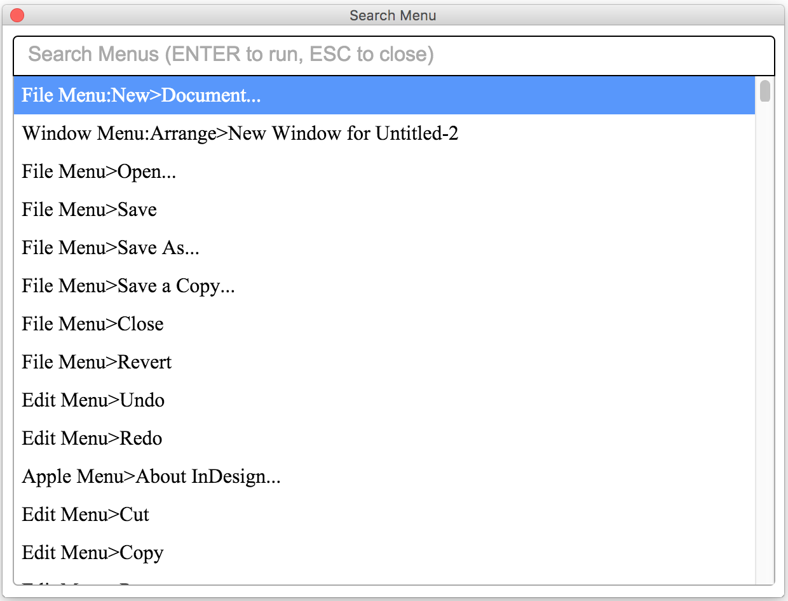

# QuickApply-CEP
This is a HTML5 extension of Adobe InDesign that implements the feature of Quick Apply.



- Tested in InDesign CC 2015 and 2017
- It will take seconds to load the menu items on first launch
- Fuzzy search on menu names 


# Installation
1. Copy the entire folder *QuickApply-CEP* to the system extension folder
  ```
  Mac: /Library/Application Support/Adobe/CEP/extensions/
  Win: C:\Program Files (x86)\Common Files\Adobe\CEP\extensions\
  ```
2. Launch Adobe InDesign CC 2015[7].
3. Open the dialog with menu *[Window->Extensions->Search Menu]*.

# License
MIT
